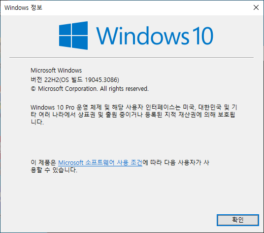
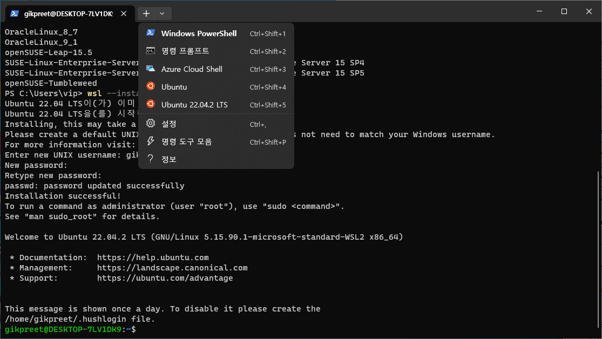

# Install NHN Academy Development Enrvironment for Java Developer on Windows 10
여기에서는 Java 개발을 위한 환경을 Windows 10이 설치된 컴퓨터 상에서 구성합니다. 이 설치는 Windows 10 20H2, 빌드 18362이상의 버전(Windows 11 포함)에서 유효합니다.

## 1. 설치 개요
NHN Academy에서는 Java 개발을 위해 Linux 운영체제의 배포본인 Ubuntu 20.04 이상 버전을 사용합니다. Windows 운영체제가 설치된 컴퓨터에서 Linux를 실행하기 위해서는 가상화, Docker, WSL등 여러가지 방법이 있습니다.

* 가상화
Hypervisor를 사용해서 운영체제에 가상화된 운영체제를 설치하여 사용하는 방법으로, Windows 10 Professional 이상의 버전에서 기본으로 제공되는 Hyper-V나, VMWare와 같은 Hypervisor, Virtual PC와 같은 데스크톱 가상화를 사용해서 Windows 운영체제를 기반으로 Hypervisor 계층위에서 Linux 운영체제를 동작시키는 방법입니다.
* Docker
프로세스 격리 기술을 사용하여 가상화된 운영체제를 사용하는 방법으로, 가상화에 비헤 설치가 간단하고 쉽고 빠르게 원하는 환경만을 구성할 수 있다는 장점이 있습니다.
* WSL(Windows Subsystem for Linux)
Windows 운영체제에서 경량화된 가상화 기술을 사용하여 Linux 운영체제를 구동하게 해주는 기술로, Windows Kernel(WSL) 또는 Hypervisor(WSL2)을 사용하여 Linux를 구동하며, 경량화되어 빠르게 사용할 수 있습니다.

NHN Academy는 Java의 기본 개발 환경으로 Linux 운영체제를 사용하며, 다양한 환경에서 Java를 사용하는 방법을 학습합니다. Windows 10 이상의 운영체제에서 가장 간단한 방법으로 Linux 운영체제를 사용할 수 있는 방법은 Windows Subsystem for Linux를 사용하는 것이며, Java Classic 환경에서는 WSL을 사용합니다.

**중요: 이 작업을 위해서는 해당 컴퓨터의 CPU 가상화 기술이 활성화되어 있어야 합니다**

## 2. Windows Terminal 설치
Windows Terminal은 명령 프롬프트, Powershell 및 WSL, 다른 터미널 형식의 응용 프로그램올 통합해서 사용할 수 있는 가상 터미널 응용 프로그램입니다. Windows Terminal은 다중 탭과 텍스트 렌터링에 GPU 가속 지원, 다양한 추가 설정이 가능한 등의 여러 기능을 지원합니다.

Windows Terminal 설치를 위해 아래 절차를 따릅니다.

1. Windows PowerShell을 실행합니다.
2. 아래 명령을 실행하여 실행중인 Windows의 버전과 빌드 번호를 확인합니다.
```
> winver
```


> - wsl2는 Windows 10 버전 1903, 빌드 18362 이상에서 동작합니다.
> - 동작중인 Windows 10이 그 이하의 버전이면, 이상의 버전으로 업그레이드 해야 합니다.
> - Windows 10의 최종 버전인 22H2 버전으로 업그레이드 하는 것이 좋습니다.
> - 2023년 6월 기준, 최신 빌드는 19045.3088 입니다.

3. 아래 명령을 실행하여 Windows에 설치된 패키지를 확인합니다.
```
> winget list
```
> winget이 발견되지 않으면 Microsoft Store에서 winget으로 검색하고 App Installer(앱 설치 관리자)를 설치합니다.  
> winget 설치에 실패할 경우 Windows Terminal을 Microsoft Store에서 직접 설치할 수 있습니다.

4. 아래 명령을 실행하여 Windows Terminal 설치 여부를 확인합니다.
```
> winget list | findstr "Terminal"
```
> 아래와 같은 메시지를 출력하여 설치된 것으로 확인되면 **2. Windows 10에서 wsl2 설치** 단계로 넘어갑니다.
```
Windows ?????                          Microsoft.WindowsTerminal                 1.17.11461.0                  winget
```
5. 설치가 발견되지 않으면 아래 명령을 실행하여 Windows Terminal을 설치합니다.
```
> winget install --id=Microsoft.WindowsTerminal -e
```

6. 설치가 진행됩니다.
7. 설치가 완료되면, 아래쪽 **찾기** 창에서 "터미널"을 입력하여 설치를 확인합니다.

## 5. Windows Subsystem for Linux 설치
여기에서는 wsl2를 설정하고 Ubuntu 22.04를 설치합니다. 아래 절차에 따릅니다.

1. Windows Terminal을 관리자 모드로 실행합니다.
2. Windows Terminal에 실행된 Powershell에서, 아래 명령을 실행하여 wsl을 설치합니다.
```
> wsl --install
```
3. 조금 기다리면 아래와 같은 설치완료 메시지가 표시됩니다.
```
설치 중: 가상 머신 플랫폼
가상 머신 플랫폼이(가) 설치되었습니다.
설치 중: Linux용 Windows 하위 시스템
Linux용 Windows 하위 시스템이(가) 설치되었습니다.
설치 중: Linux용 Windows 하위 시스템
Linux용 Windows 하위 시스템이(가) 설치되었습니다.
설치 중: Ubuntu
Ubuntu이(가) 설치되었습니다.
요청한 작업이 잘 실행되었습니다. 시스템을 다시 시작하면 변경 사항이 적용됩니다.
```
4. 컴퓨터를 리부팅 합니다.
5. 컴퓨터가 시작되면, Windows Terminal을 실행합니다.
6. 아래 명령을 실행하여 설치 가능한 리눅스 배포본 목록을 확인합니다.
```
> wsl --list --online
```
7. 아래와 같은 목록을 볼 수 있습니다.
```
Linux용 Windows 하위 시스템에 설치된 배포판이 없습니다.

'wsl.exe --list --online'를 사용하여 사용 가능한 배포판을 나열하고
'wsl.exe --install <Distro>'를 사용하여 설치하세요.

배포판은 Microsoft Store
(https://aka.ms/wslstore)를
방문하여 설치할 수도 있습니다.
Error code: Wsl/WSL_E_DEFAULT_DISTRO_NOT_FOUND
PS C:\Users\vip> wsl --list --online
다음은 설치할 수 있는 유효한 배포판 목록입니다.
'wsl.exe --install <Distro>'를 사용하여 설치합니다.

NAME                                   FRIENDLY NAME
Ubuntu                                 Ubuntu
Debian                                 Debian GNU/Linux
kali-linux                             Kali Linux Rolling
Ubuntu-18.04                           Ubuntu 18.04 LTS
Ubuntu-20.04                           Ubuntu 20.04 LTS
Ubuntu-22.04                           Ubuntu 22.04 LTS
OracleLinux_7_9                        Oracle Linux 7.9
OracleLinux_8_7                        Oracle Linux 8.7
OracleLinux_9_1                        Oracle Linux 9.1
openSUSE-Leap-15.5                     openSUSE Leap 15.5
SUSE-Linux-Enterprise-Server-15-SP4    SUSE Linux Enterprise Server 15 SP4
SUSE-Linux-Enterprise-Server-15-SP5    SUSE Linux Enterprise Server 15 SP5
openSUSE-Tumbleweed                    openSUSE Tumbleweed
```
8. 아래 명령을 실행하여 Ubuntu 22.04 버전을 설치합니다.
```
> wsl --install -d Ubuntu-22.04
```
9. 설치가 진행되고, wsl 상에서 Ubuntu22.04 배포본이 시작됩니다. Ubuntu 배포본의 사용자 이름과 패스워드를 입력하면 설치가 되고, 배포본 프롬프트가 실행됩니다.
```
Ubuntu 22.04 LTS이(가) 이미 설치되어 있습니다.
Ubuntu 22.04 LTS을(를) 시작하는 중...
Installing, this may take a few minutes...
Please create a default UNIX user account. The username does not need to match your Windows username.
For more information visit: https://aka.ms/wslusers
Enter new UNIX username: gikpreet
New password:
Retype new password:
passwd: password updated successfully
Installation successful!
To run a command as administrator (user "root"), use "sudo <command>".
See "man sudo_root" for details.

Welcome to Ubuntu 22.04.2 LTS (GNU/Linux 5.15.90.1-microsoft-standard-WSL2 x86_64)

 * Documentation:  https://help.ubuntu.com
 * Management:     https://landscape.canonical.com
 * Support:        https://ubuntu.com/advantage


This message is shown once a day. To disable it please create the
/home/gikpreet/.hushlogin file.
```
10. Windows 터미널의 위쪽 탭에서, 설치한 우분투 배포본이 활성화 되어 있는 것을 확인합니다.

