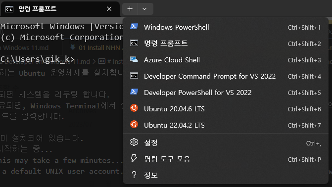

# Install NHN Academy Development Enrvironment for Java Developer on Windows 11
여기에서는 Java 개발을 위한 환경을 Windows 10이 설치된 컴퓨터 상에서 구성합니다. 이 설치는 Windows 10 20H2, 빌드 18362이상의 버전(Windows 11 포함)에서 유효합니다.

## 1. 설치 개요
NHN Academy에서는 Java 개발을 위해 Linux 운영체제의 배포본인 Ubuntu 20.04 이상 버전을 사용합니다. Windows 운영체제가 설치된 컴퓨터에서 Linux를 실행하기 위해서는 가상화, Docker, WSL등 여러가지 방법이 있습니다.

* 가상화
Hypervisor를 사용해서 운영체제에 가상화된 운영체제를 설치하여 사용하는 방법으로, Windows 10 Professional 이상의 버전에서 기본으로 제공되는 Hyper-V나, VMWare와 같은 Hypervisor, Virtual PC와 같은 데스크톱 가상화를 사용해서 Windows 운영체제를 기반으로 Hypervisor 계층위에서 Linux 운영체제를 동작시키는 방법입니다.
* Docker
프로세스 격리 기술을 사용하여 가상화된 운영체제를 사용하는 방법으로, 가상화에 비헤 설치가 간단하고 쉽고 빠르게 원하는 환경만을 구성할 수 있다는 장점이 있습니다.
* WSL(Windows Subsystem for Linux)
Windows 운영체제에서 경량화된 가상화 기술을 사용하여 Linux 운영체제를 구동하게 해주는 기술로, Windows Kernel(WSL) 또는 Hypervisor(WSL2)을 사용하여 Linux를 구동하며, 경량화되어 빠르게 사용할 수 있습니다.

NHN Academy는 Java의 기본 개발 환경으로 Linux 운영체제를 사용하며, 다양한 환경에서 Java를 사용하는 방법을 학습합니다. Windows 10 이상의 운영체제에서 가장 간단한 방법으로 Linux 운영체제를 사용할 수 있는 방법은 Windows Subsystem for Linux를 사용하는 것이며, Java Classic 환경에서는 WSL을 사용합니다.

**중요: 이 작업을 위해서는 해당 컴퓨터의 CPU 가상화 기술이 활성화되어 있어야 합니다**

## 2. wsl을 사용하여 Windows에 Linux 설치
여기에서는 Windows 11에서 wsl2를 설치합니다. Microsoft의 [공식 설치 매뉴얼](https://learn.microsoft.com/ko-kr/windows/wsl/install)을 참조할 수 있습니다.
1. 시작 버튼을 클릭하고 터미널을 검색하여 실행합니다.
2. 아래 명령을 실행하여 wsl을 설치합니다.
```
> wsl --install
```
위 명령은 다음 동작들을 포함합니다.
```
* Windows의 VirtualMachinePlatform 기능을 설치합니다.
* Windows의 Windows Subsystem for Linux 기능을 설치합니다.
* WSL에서 동작하는 Ubuntu 운영체제를 설치합니다.
```
3. 설치가 완료되면 시스템을 리부팅 합니다.
4. 리부팅이 완료되면, Windows Terminal에서 설정이 완료되기를 기다린 후, 설치된 Ubuntu 운영체제의 사용자와 패스워드를 입력합니다.
```
Ubuntu이(가)이미 설치되어 있습니다.
Ubuntu을(를) 시작하는 중...
Installing, this may take a few minutes...
Please create a default UNIX user account. The username does not need to match your Windows username.
For more information visit: https://aka.ms/wslusers
Enter new UNIX username:
New password:
Retype new password:
passwd: password updated successfully
Installation successful!
```
5. 아래 명령을 실행하여 설치된 Ubuntu 정보를 확인합니다.
```sh
$ lsb_relese -a
No LSB modules are available.
Distributor ID: Ubuntu
Description   : Ubuntu 22.04.2 LTS
Release       : 22.04
Codename      : Jammy
```
6. 설치가 완료되었습니다.

## 3. 설치 확인
1. Windows Terminal을 실행합니다.
2. 기본 창 옆의 아래쪽 화살표를 클릭하고 Ubuntu <버전>이 표시되는 것을 확인합니다.

> 기본 명령으로 설치했을 경우, Ubuntu의 버전이 표시되지 않습니다.
> WSL에는 여러 버전의 Linux를 여러 개 설치할 수 있습니다. 위 그림은 Ubuntu 22.04와 20.04 두 Ubuntu Liunx가 설치된 것을 보여줍니다.
3. 설치된 Linux를 클릭합니다. Ubuntu Linux가 실행됩니다.
