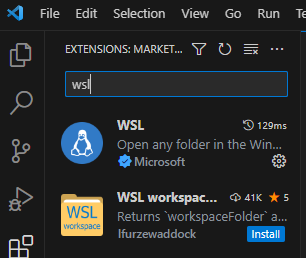

# Install and Configure Java Programming Environment on Ubuntu
이 연습에서는 Ubuntu에서 Java 프로그래밍 환경을 구성합니다. 아래 절차에 따릅니다.

## JDK (Java Development Kit) 설치
1. 터미널을 실행합니다.
2. 아래 명령을 실행하여 패키지를 업데이트 합니다.
```bash
$ sudo apt update
```
3. 아래 명령을 실행하여 패키지 리포지토리 정보를 다운로드합니다.
```bash
$ wget -O - https://packages.adoptium.net/artifactory/api/gpg/key/public | sudo apt-key add -
```
4. 아래 명령을 실행하여 패키지 정보를 업데이트 합니다.
```bash
$ echo "deb https://packages.adoptium.net/artifactory/deb $(awk -F= '/^VERSION_CODENAME/{print$2}' /etc/os-release) main" | sudo tee /etc/apt/sources.list.d/adoptium.list
```
5. 아래 명령을 실행하여 패키지를 업데이트합니다.
```bash
$ sudo apt update
```
6. 아래 명령을 실행하여 Temurin Java 11 버전을 설치합니다.
```bash
$ sudo apt install temurin-11-jdk
```
7. 아래 명령을 실행하여 설치된 Java를 확인합니다.
```bash
$ java --version
openjdk 11.0.19 2023-04-18
OpenJDK Runtime Environment Temurin-11.0.19+7 (build 11.0.19+7)
OpenJDK 64-Bit Server VM Temurin-11.0.19+7 (build 11.0.19+7, mixed mode)
$ javac -version
javac 11.0.19
```

## Visual Studio Code 설치 (WSL이 아닌 Ubuntu를 바로 설치한 경우)
이 연습에서는 Ubuntu에 Visual Studio Code를 설치합니다. 아래 절차에 따릅니다.

1. sudo 권한이 있는 사용자로, 다음 명령을 실행하여 패키지 인덱스를 업데이트하고 종속성을 설치합니다.
```bash
$ sudo apt update
$ sudo apt install software-properties-common apt-transport-https wget
```
2. 아래 wget 명령을 실행하여 Microsoft GPG 키를 가져옵니다.
```bash
$ wget -q https://packages.microsoft.com/keys/microsoft.asc -O- | sudo apt-key add -
```
3. 아래 명령을 실행하여 Visual Studio Code 리포지토리를 활성화 합니다.
```bash
$ sudo add-apt-repository "deb [arch=amd64] https://packages.microsoft.com/repos/vscode stable main"
```
4. 아래 명령을 실행하여 Visual Studio Code를 설치합니다.
```
$ sudo apt install code
```

## WSL 사용자의 경우
WSL에서 Ubuntu를 사용하는 경우, Visual Studio Code를 호스트 운영체제인 Windows에 설치해야 합니다. 여기에서는 winget을 사용하여 호스트 운영체제에 Visual Studio Code를 설치합니다.

1. Windows Terminal을 실행합니다.
2. PowerShell에서, 아래 명령을 실행하여 Visual Studio Code를 설치합니다.
```powershell
> winget install -e --id Microsoft.VisualStuduoCode
```
3. 설치가 완료되면 Visual Studo Code를 실행합니다.
4. Visual Studo Code 왼쪽의 *Extensions*를 클릭하고 wsl 확장을 검색하여 설치합니다.  


## Visual Studio Code에서 Java extension 설치
이 연습에서는 Visual Studio Code에 Java 확장을 설치합니다. 아래 절차에 따릅니다.

1. Visual Studio Code를 실행합니다.
2. 왼쪽 패널에서 Extensions를 클릭하고 검색 텍스트 상자에 Java를 입력합니다.


3. Extension Pack for Java를 설치합니다.

