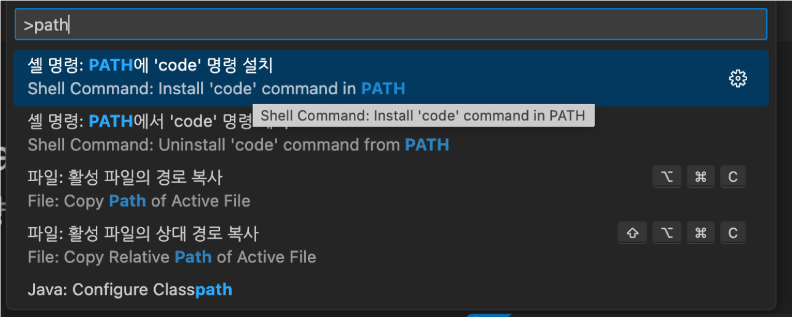

# Install and Configure Java Programming Environment on MacOS
이 연습에서는 MacOS에서 Java 프로그래밍 환경을 구성합니다. 아래 절차에 따릅니다.

## Homebrew 설치
이 연습에서는 homebrew를 설치합니다. 아래 절차에 따릅니다.

1. 터미널을 실행합니다.
2. 터미널에서 아래 명령을 실행하여 homebrew가 설치되어 있는지 확인합니다.
```bash
% brew -v
```
3. homebrew가 설치되어 있지 않으면 아래 명령을 실행하여 homebrew를 설치합니다.
```bash
% /bin/bash -c "$(curl -fsSL https://raw.githubusercontent.com/Homebrew/install/HEAD/install.sh)"
```
> **참고** 위 명령이 동작하지 않으면 https://brew.sh/index_ko 에 방문하여 설치 스크립트를 얻어 실행합니다.
4. 아래 명령을 실행하여 homebrew를 업데이트합니다.
```bash
% brew update
```

## JDK (Java Development Kit) 설치
이 연습에서는 homebrew를 사용하여 Temurin JDK 11을 설치합니다. 아래 절차에 따릅니다.

### JDK 설치 확인
1. 터미널을 실행합니다.
2. 아래 명령을 실행하여 Java가 설치되어 있는지 확인합니다.
```bash
% java -version
```
3. Java가 설치되어 있어 Java 버전이 표시된다면, 설치된 Java를 삭제합니다.

### Temurin JDK 설치
1. 아래 명령을 실행하여 cask를 설치합니다.
> **참고** cask는 homwbrew의 확장으로, macOS 응용 프로그램을 brew를 통해 설치할 수 있도록 해주는 유틸리티입니다.
```bash
% brew install cask
```
2. 아래 명령을 실행하여 repository를 추가합니다.
```bash
% brew tap homebrew/cask-versions
```
3. 아래 명령을 수행하여 temurin JDK 11을 설치합니다.
```bash
% brew install --cask temurin11
```
4. 아래 명령을 수행하여 설치된 temurin JDK를 확인합니다.
```bash
% java -version
openjdk version "11.0.19" 2023-04-18
OpenJDK Runtime Environment Temurin-11.0.19+7 (build 11.0.19+7)
OpenJDK 64-Bit Server VM Temurin-11.0.19+7 (build 11.0.19+7, mixed mode)
% javac -version
javac 11.0.19
```

## Visual Studio Code 설치
이 연습에서는 brew를 사용하여 Visual Studio Code를 설치합니다. 아래 절차에 따릅니다.

1. 아래 명령을 실행하여 brew에서 Visual Studio Code를 검색합니다.
```bash
% brew search visual-studio-code
```
2. 아래 명령을 실행하여 Visual Studio Code를 설치합니다.
```bash
% brew install --cask visual-studio-code
```
3. 아래 명령을 실행하여 설치된 Visual Studio Code를 확인합니다.
```bash
% brew list
```

## Visual Studio Code path 설정
이 연습에서는 Visual Studio Code의 원활한 사용을 위해 path를 설정합니다. Windows와 Linux 운영체제에서는 Visual Studio Code를 설치하면 path가 지정되므로, 작업이 필요하지 않습니다.

> 이 작업은 macOS 운영체제에서만 실행합니다.

1. Visual Studio Code를 실행합니다.
2. Ctrl + Shift + P 키를 눌러 명령 팔레트를 열고, path로 검색한 후 아래 명령을 실행합니다.
```
Shell Command: Install ‘code’ command in PATH
(한글) 셸 명령: PATH에 'code' 명령 설치
```


3. 지문 인식 또는 패스워드를 입력하여 인증을 제공합니다.
4. 터미널을 열고, 아래 명령을 실행하여 path를 확인합니다.
```
% code -v
```
