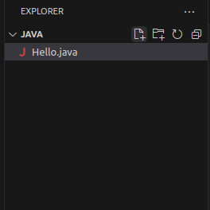

# Install and Configure Java Programming Environment
## Utuntu에 Java 설치
이 연습에서는 Ubuntu에 Java 프로그래밍 환경을 설치합니다. 아래 절차에 따릅니다.

1. 터미널을 실행합니다.
2. 아래 명령을 실행하여 패키지를 업데이트 합니다.
```bash
$ sudo apt update
```
3. 아래 명령을 실행하여 패키지 리포지토리 정보를 다운로드합니다.
```bash
$ wget -O - https://packages.adoptium.net/artifactory/api/gpg/key/public | sudo apt-key add -
```
4. 아래 명령을 실행하여 패키지 정보를 업데이트 합니다.
```bash
$ echo "deb https://packages.adoptium.net/artifactory/deb $(awk -F= '/^VERSION_CODENAME/{print$2}' /etc/os-release) main" | sudo tee /etc/apt/sources.list.d/adoptium.list
```
5. 아래 명령을 실행하여 패키지를 업데이트합니다.
```bash
$ sudo apt update
```
6. 아래 명령을 실행하여 Temurin Java 11 버전을 설치합니다.
```bash
$ sudo apt install temurin-11-jdk
```
7. 아래 명령을 실행하여 설치된 Java를 확인합니다.
```bash
$ java --version
openjdk 11.0.19 2023-04-18
OpenJDK Runtime Environment Temurin-11.0.19+7 (build 11.0.19+7)
OpenJDK 64-Bit Server VM Temurin-11.0.19+7 (build 11.0.19+7, mixed mode)
$ javac -version
javac 11.0.19
```

## Visual Studio Code 설치
이 연습에서는 Ubuntu에 Visual Studio Code를 설치합니다. 아래 절차에 따릅니다.

1. 웹 브라우저를 실행하고 아래 웹 사이트로 이동합니다.
```
https://code.visualstudio.com/download
```
2. 웹 사이트에서 컴퓨터의 아키텍처에 맞는 .deb 파일을 클릭하여 다운로드 합니다.

3. Downloads 디렉토리로 이동하고, 아래 명령을 실행하여 Visual Studio Code를 설치합니다.
```bash
$ sudo apt install ./code-<filename>
```

## Visual Studio Code에서 Java extension 설치
이 연습에서는 Visual Studio Code에 Java 확장을 설치합니다. 아래 절차에 따릅니다.

1. Visual Studio Code를 실행합니다.
2. 왼쪽 패널에서 Extensions를 클릭하고 검색 텍스트 상자에 Java를 입력합니다.

3. Extension Pack for Java를 설치합니다.


## Hello, World! 응용 프로그램 작성
이 연습에서는 첫 번째 Java 응용 프로그램, Hello, World!를 작성합니다. 아래 절차에 따릅니다.

1. Visual Studio Code의 파일 메뉴에서 Open Folder를 클릭합니다.
2. 코드가 위치할 디렉토리를 지정하고 오른쪽 위의 Open 버튼을 클릭합니다.
3. Yes, I trust the authors 버튼을 클릭합니다.
4. Explore에서 New File 버튼을 클릭하고 Hello.java 파일을 추가합니다.  

5. 코드 에디터에 아래와 같은 코드를 작성합니다.
```java
public class Hello {
    public static void main(String[] args) {
        System.out.println("Hello, World!");
    }
}
```
6. Visual Studio Code의 Terminal 메뉴에서 new Terminal을 클릭합니다.
7. 터미널에서, 아래 명령을 실행하여 작성한 코드를 컴파일합니다.
```bash
$ javac Hello.java
```
8. 컴파일이 완료되면, Hello.class 파일이 생성됩니다. 아래 명령을 실행하여 Hello 응용 프로그램을 실행합니다.
```bash
$ java Hello
Hello, World!
```


