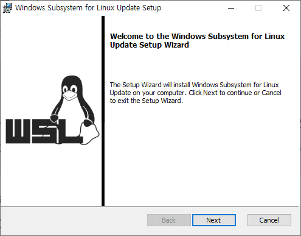

## 3. Windows 10에서 Windows Subsystem for Linux와 VirutualMachinePlatform 기능 설치
여기에서는 Windows 10에 wsl2를 설치합니다. 아래 절차에 따릅니다.

1. Windows Terminal을 관리자 모드로 실행합니다.
2. 아래 명령을 실행하여 Microsoft-Windows-Subsystem-Linux와 VirtualMachinePlatform 기능이 시스템에 설치되어 있는지 확인합니다.
```
> dism /online /Get-Features
```
> 아래와 같이 설치되어 있으면, **4. Windows Subsystem for Linux Update 설치** 단계로 넘어갑니다.
```
기능 이름 : VirtualMachinePlatform
상태 : 사용
...
기능 이름 : Microsoft-Windows-Subsystem-Linux
상태 : 사용
```
3. 두 기능이 설치되어 있지 않으면, 아래 명령을 실행하여 두 Windows 기능을 설치합니다. 터미널은 관리자 모드로 실행되어 있어야 합니다.
```
> dism.exe /online /enable-feature /featurename:Microsoft-Windows-Subsystem-Linux /all /norestart
...
> dism.exe /online /enable-feature /featurename:VirtualMachinePlatform /all /norestart
```

## 4. Windows Subsystem for Linux Update 설치
여기에서는 wsl2 설치를 위해 Windows Subsystem for Linux 커널 업데이트를 설치합니다. 아래 절차를 따릅니다.

1. [WSL2 Linux 커널 업데이트 패키지](https://wslstorestorage.blob.core.windows.net/wslblob/wsl_update_x64.msi) 링크를 클릭하여 패키지를 다운로드 합니다.
2. 다운로드 한 *wsl_update_x64.msi* 파일을 실행하여 설치합니다.  
  