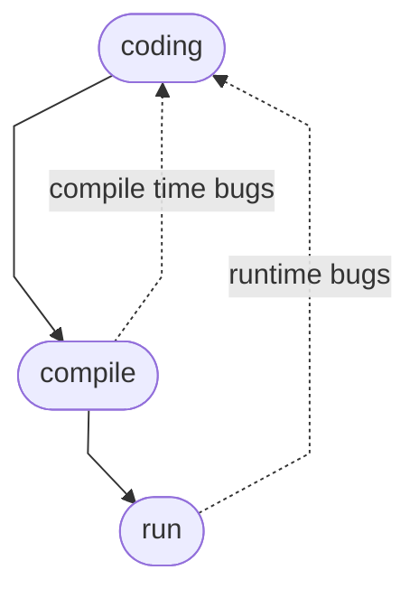

# Development Environment (개발 환경)

## Git

1. git 설치
1. `cd ~/Documents &&
    git clone --depth 1 https://github.com/nhnacademy/settings`
1. [README](https://github.com/nhnacademy/settings/blob/main/README.md)

## Compile & Run

```sh
command -v javac # javac라는 명령을 쓸 수 있나요?
echo $? # 그렇다면 return 값은 0
javac --version # Java compiler
command -v java && echo yes # 한 줄로 확인
java --version # JVM(Java virtual machine)
```

```sh
file Demo.java
javac Demo.java # compile
[ -e "Demo.class" ] &&
  [ -x "Demo.class" ] &&
  ./Demo.class ||
  echo Demo.class is not executable
./Demo.class
echo $?
ls -l Demo.class # check -rwx- permission
file Demo.class
java Demo # run everywhere with JVM
```

```sh
od -ac Demo.class # octal dump
javap -v Demo # byte code viewer
javap -v java.lang.Object
```

```sh
# 모든 일을 한 줄로
# command sequence with &&
rm Demo.class # rm -f Demo.class
command -v javac &&
  command -v java &&
[ -e "Demo.java" ] &&
  [ ! -e "Demo.class" ] &&
  javac Demo.java &&
  java Demo
```

## Java 프로그램 구조

[HelloWorldApp](https://docs.oracle.com/javase/tutorial/getStarted/application/index.html)
  - code & compile & run
  - line, block & documentation comments
  - main method
  - System class, out[^stdout] object, println method

### 실습:

[`Demo`](Demo.java) application에서:

- main을 Main으로 바꾸면?
- class 이름을 Demo에서 demo로 바꾸면?
- main 앞의 public을 지우면?
- class 앞의 public을 지우면?
- `cp Demo.java Hidden.java && javac Hidden.java && java Hidden`?
- `java 02/Demo`?
- `java Demo > demo.out && cat demo.out`[^redirection]

### 요약

* Java 프로그램은 class 집합입니다.
* class 속에 여러 method를 정의합니다.
* static method를 class method라고 합니다.
* class method는 다른 언어에서 function 또는 procedure라고 합니다.


### Convention

- class 이름은 대문자로, method 이름은 소문자로 시작합니다.


## Development

### Cycle



### 실습

[Error](Error.java) application에서:

- compile하면 어떤 문제가 언제 생기나요? 이런 error를 뭐라고 하나요?
  - editor에서 line/block comment 다는 단축키는?
  - line comment로 error 난 줄을 가려서 compile 되도록 고치세요.
- compile & run하면 어떤 문제가 언제 생기나요? 이런 error를 뭐라고 하나요?
  - `java Error`의 exit status는?
  - 실험하고 동작 원리를 설명합니다.[^cat]
    ```sh
    java Error > error.err && cat error.err
    java Error 2> error.err && cat error.err
    java Error 2> error.err || cat error.err
    java Error 2> error.err ; cat error.err
    ```


<!-- 각주 -->
[^stdout]: out은 OS(Operating System)의 standard output stream을 java 프로그램을 짤 때 쓸 수 있도록 포장한 object입니다.
  Standard stream에는 input(stdin), output(stdout), error(stderr) 세 개가 있습니다.
  차례대로 Java의 System.in, System.out, System.err에 대응합니다.
  Byte stream을 읽고(stdin), 내보내는데(stdout)씁니다.
  Error message나 log처럼 application의 실행 결과가 아닌 데이터를 격리해서 내보내는 데 stderr을 씁니다.
[^redirection]: [ >(redirection)](https://www.redhat.com/sysadmin/linux-shell-redirection-pipelining)
연산자는 application이나 command에 들고나는 데이터가 다른 file에서 오갈 수 있도록 흐름을 바꿉니다(redirect).
  - 흔히 OS(Operating System)의 standard stream을 오가는 byte stream을 잡아채서 file에서 읽고 쓰도록 하는 데 씁니다.
  - Process는 file, pipe, socket 같은 data stream을 식별하고자(a process-unique identifier) 고유 번호(file descriptor, FD)를 매기는데 stdin, output, error의 FD는 차례대로 0, 1, 2입니다.
[^cat]: cat은 여러 file을 차례대로 이어 붙여(con**cat**enate) stdout으로 보내는 application입니다. `cat demo.out error.err` 해보세요.
